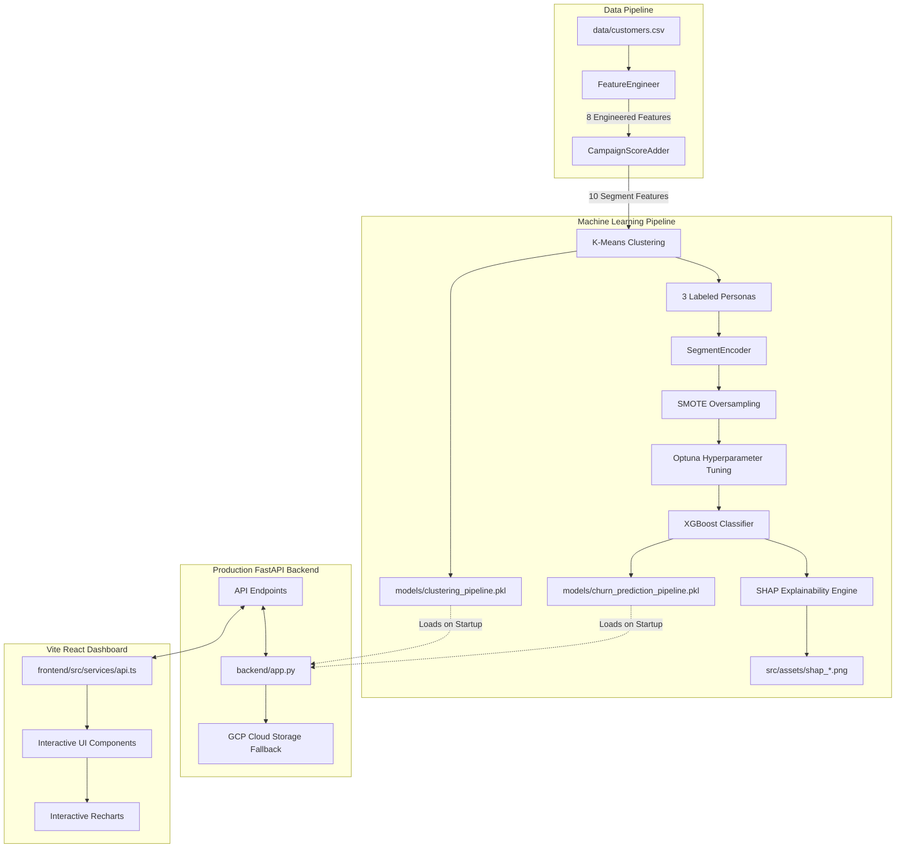

#  Vanguard Suite | Customer Insights Engine

[](https://fastapi.tiangolo.com)
[](https://reactjs.org)
[](https://vitejs.dev)
[](https://xgboost.readthedocs.io)
[](https://scikit-learn.org)
[](https://optuna.org)
[](https://github.com/shap/shap)
[](https://pytest.org)
[](https://www.python.org)

An **end-to-end AI-powered behavioral analytics platform** that combines **unsupervised clustering (K-Means)** for customer segmentation with a **supervised classifier (XGBoost)** to predict customer churn. It features a fully-functional Vite + React dashboard, a robust FastAPI backend with dual local/GCP storage fallback strategy, and a pipeline for model explainability (SHAP).

---

## 📐 System Architecture

The following diagram illustrates the flow of data through the Customer Insights Engine—from raw inputs to model serving, explainability, and frontend visualization:



---

## ✨ Key Features

- **Behavioral Customer Segmentation**: K-Means clustering dynamically groups customers into actionable personas (High Engagement, Low Engagement, Medium Engagement).
- **High-Performance Churn Prediction**: Optuna-optimized XGBoost classifier achieving **91.47% ROC-AUC** for churn/campaign response forecasting.
- **Explainable AI (XAI)**: Generates 5 distinct SHAP visualizations (Beeswarm, Bar, Waterfall, Dependence, Force plots) to provide mathematical transparency for predictions.
- **Production-Grade API**: Modular FastAPI backend with structured logging, CORS integration, custom error handling, and robust Pydantic data schemas.
- **Hybrid Storage Strategy**: Smart startup logic that loads model assets from **Google Cloud Storage (GCS)**, falling back seamlessly to local pickled binaries.
- **Modern Dashboard UI**: Real-time analytics dashboard built with React, Vite, TailwindCSS, Framer Motion, and Recharts.
- **Test-Driven Design**: Robust test suite using `pytest` covering custom Scikit-Learn transformers and FastAPI endpoints.

---

## 📁 Project Structure

```text
Customer Insights Engine/
├── backend/                    # FastAPI Backend
│   ├── app.py                  # API definition and startup logic
│   ├── config.py               # Centralized configuration (directories, API names, thresholds)
│   ├── models.py               # Pydantic request/response validation schemas
│   ├── REQUIREMENTS.txt        # Backend dependencies
│   └── TESTING.md              # Backend endpoint manual testing guide
├── data/                       # Datasets
│   ├── customers.csv           # Raw customer profile dataset
│   └── customers_segmented.csv # Segmented customer dataset generated by K-Means
├── frontend/                   # Vite React Frontend Dashboard
│   ├── src/                    # UI code, state managers, API wrappers
│   │   ├── components/         # Reusable dashboard widgets & charts
│   │   ├── services/           # Axios HTTP client service mappings
│   │   └── types/              # TypeScript typings
│   ├── package.json            # Frontend script actions & dependencies
│   └── vite.config.ts          # Vite proxy & development configurations
├── ml/                         # Machine Learning Modules
│   ├── pipelines/              # ML Pipeline definitions
│   │   └── training_pipeline.py# Alternate composite training pipeline
│   ├── preprocessing.py        # Custom Scikit-Learn transformers (SMOTE, FeatureEngineer)
│   ├── train.py                # Hyperparameter tuning logic
│   └── visualization.py        # Non-blocking visualization pipeline (Matplotlib 'Agg' backend)
├── models/                     # Pickled Pipeline Binaries
│   ├── clustering_pipeline.pkl # K-Means clusterer and scaling objects
│   └── churn_prediction_pipeline.pkl # Trained XGBoost predictor and label encoders
├── notebooks/                  # Jupyter Notebooks for EDA & research
├── tests/                      # Automated Testing Suite
│   ├── test_api.py             # Integration tests for FastAPI endpoints
│   └── test_preprocessing.py   # Unit tests for custom preprocessing transformers
├── requirements.txt            # Root python project dependencies
├── train_models.py             # Root ML training orchestrator
└── README.md                   # This project index
```

---

## 🚀 Setup & Execution

Ensure you have Python 3.8+ and Node.js 18+ installed on your machine.

### 1. Environment Setup

Create a virtual environment and install the Python dependencies:

```bash
# Clone the repository
git clone https://github.com/your-username/customer-insights-engine.git
cd customer-insights-engine

# Create and activate virtual environment
python3 -m venv venv
source venv/bin/activate

# Install requirements (handles Python 3.14+ compatibility)
pip install -r requirements.txt
```

*(Optional)* Install `libomp` if running on macOS to enable XGBoost multi-threading support:
```bash
brew install libomp
```

### 2. Run the Machine Learning Pipeline

Execute the orchestrator script to run feature engineering, train K-Means clustering and the XGBoost classifier, tune hyperparameters, and generate SHAP explainability assets:

```bash
python train_models.py
```

*Expected Output Files:*
- `models/clustering_pipeline.pkl`
- `models/churn_prediction_pipeline.pkl`
- `data/customers_segmented.csv`
- `src/assets/*.png` (All SHAP, confusion matrix, and cluster plots)

### 3. Start the Backend API

Launch the Uvicorn-hosted FastAPI backend server:

```bash
python -m uvicorn backend.app:app --reload --port 8000
```
- **API URL**: `http://localhost:8000`
- **Interactive Swagger Docs**: `http://localhost:8000/docs`

### 4. Start the Frontend Dashboard

Navigate to the frontend directory, install npm packages, and spin up the Vite development server:

```bash
cd frontend
npm install
npm run dev
```
- **Dashboard URL**: `http://localhost:3000`

### 5. Run Automated Tests

To execute the test suite (covering unit tests for feature engineering and endpoint checks):

```bash
pytest tests/
```

---

## 🎯 API Endpoints

| Method | Endpoint | Description | Request Schema |
|:---|:---|:---|:---|
| `GET` | `/` | API system status and timestamp | None |
| `GET` | `/health` | Server health check showing model initialization state | None |
| `GET` | `/metrics` | Global KPIs (accuracy, segment customer counts, overall churn rate) | None |
| `POST` | `/predict` | Predict churn probability and risk level for a single customer | `CustomerInput` (Pydantic) |
| `GET` | `/segments` | Get detailed segment descriptions and suggested retention strategies | None |
| `GET` | `/feature-importance` | Retrieve top features driving the XGBoost classifier predictions | None |
| `GET` | `/cluster-distribution` | Retrieve segment counts and percentages for visualization | None |
| `POST` | `/cluster-customers` | Batch cluster raw customer CSV data | `{"customers": [...]}` |

### Customer Input & Prediction Risk Levels

SCIE groups customers into one of three risk categories based on their output probability:
- **URGENT** ($\text{Probability} \geq 0.70$): Immediate marketing intervention required.
- **MONITOR** ($0.40 \leq \text{Probability} < 0.70$ OR low-engagement segment with $\text{Probability} \geq 0.25$): Watch for declining activity.
- **STABLE** ($\text{Probability} < 0.40$): Low risk of churn.

---

## 🧠 Machine Learning Details

### Stage 1: Customer Segmentation (Unsupervised)
- **Algorithm**: K-Means Clustering (scaled using `StandardScaler`).
- **Features**: Recency, TotalSpent, TotalPurchases, AvgPurchaseValue, NumWebVisitsMonth, CampaignScore, Age, CustomerTenure, WebVisitToPurchaseRatio, PremiumProductRatio.
- **Segment Personas**:
  - **High Engagement**: Low recency, high web interaction, and high response rates.
  - **Medium Engagement**: Balanced spending and average interaction.
  - **Low Engagement**: High recency, infrequent transactions, and minimal promotions response.

### Stage 2: Churn / Campaign Classification (Supervised)
- **Algorithm**: XGBoost Classifier (with SMOTE oversampling to solve class imbalance).
- **Optimization**: Optuna hyperparameter tuning (50 trials optimizing learning rate, max depth, subsample ratios, and regularization parameters).
- **Performance**: **0.9147 ROC-AUC** score.

### Stage 3: Explainable AI (SHAP)
The engine generates 5 explainability visualizations exported to `src/assets/`:
1. **Summary Beeswarm Plot**: Explains feature impact across all predictions.
2. **Summary Bar Plot**: Visualizes mean absolute SHAP values (feature importance).
3. **Waterfall Plot**: Deconstructs individual customer predictions.
4. **Dependence Plot**: Visualizes how `Recency` interacts with other features.
5. **Force Plot**: Highlights positive and negative forces driving predictions.

---
